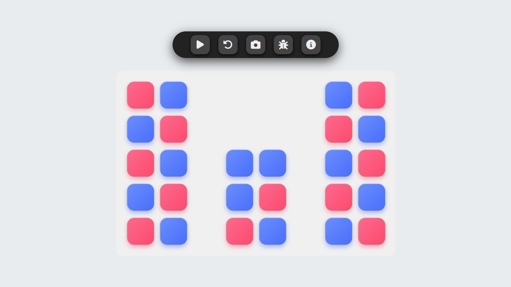

# 🎲 RandomSeats | Intelligent Seating Arrangement System

**RandomSeats**는 사용자 정의 규칙에 따라 정교하게 설계된 좌석 배치 시스템입니다.  
단일 HTML 파일로 완성되어 설치나 서버 없이 웹 브라우저만으로 즉시 실행할 수 있으며,  
배치 결과는 이미지로 저장할 수 있습니다.

---

## 🌟 주요 특징

- 🎯 **미리 정의된 규칙에 따른 정렬된 좌석 배치**
- 🔁 **실행 버튼 클릭만으로 즉시 랜덤 배치**
- 🖼️ **결과를 이미지(PNG)로 저장 가능**
- 💎 **CSS/JS 포함된 독립형 HTML 단일 파일**
- ⚡ **빠르고 가벼운 동작 — 설치 없이 즉시 사용**

---

## 🚀 시작하기

### 웹에서 실행

👉 [바로 실행](https://codemaster0524.github.io/RandomSeats/index.html)

### 로컬에서 실행

1. [📦 RandomSeats.zip](https://drive.google.com/uc?export=download&id=1o1t7U00x9fApxLuKKkOC3XEbSKarqwgW) 다운로드  
2. 압축 해제 후 `RandomSeats.html` 파일을 브라우저에서 열기  
3. 상단 UI의 ▶️ 버튼을 눌러 배치 시작  
4. 📸 버튼을 클릭해 결과를 이미지로 저장 가능

---

## 🖥️ 미리 보기

> 배치 결과 예시

---

## 🧩 기술 스택

- HTML + CSS + JavaScript (Vanilla JS)
- [Font Awesome](https://cdnjs.com/libraries/font-awesome)
- [html2canvas](https://html2canvas.hertzen.com/) — 스크린샷 기능

---

## ℹ️ 시스템 정보

- 버전: **v2.1.2**
- 제작자: **이은성**
- 이메일:  
  - 📧 eunsung_lee@hotmail.com  
  - 📧 eunsunglee7385@gmail.com  
- GitHub:  
  

---

## ⚠️ 라이선스 및 고지사항

이 소프트웨어는 **‘있는 그대로(as-is)’** 제공됩니다.

- 모든 코드는 **비상업적 개인 사용에 한해 자유롭게 사용**할 수 있습니다.  
- **무단 복제, 상업적 재배포, 임의 수정 및 배포는 금지**됩니다.  
- 사용에 따른 모든 책임은 사용자 본인에게 있습니다.

---

## 📄 LICENSE

본 프로젝트는 **GNU AGPL v3** 라이선스를 따릅니다.  
자세한 사항은 [LICENSE](./LICENSE) 파일을 참조하세요.

---

